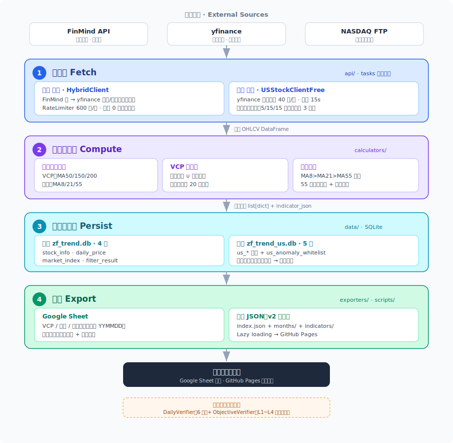
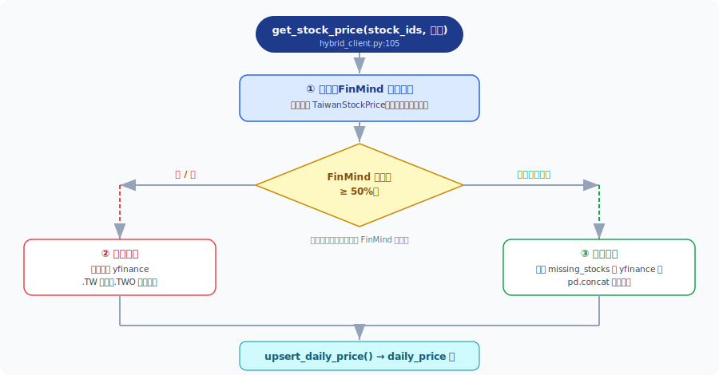
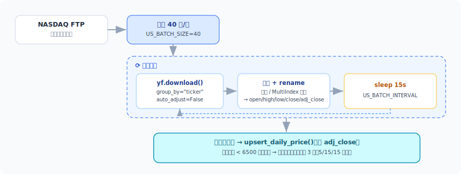
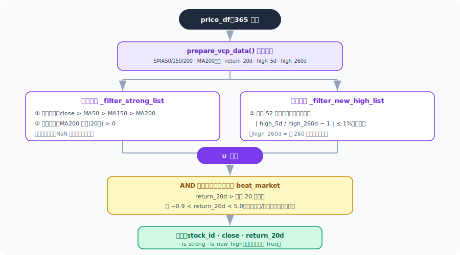
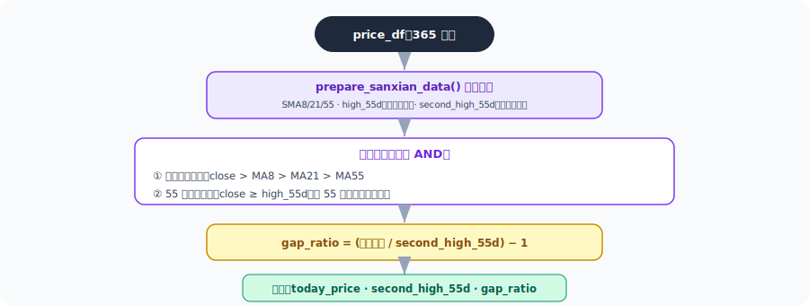
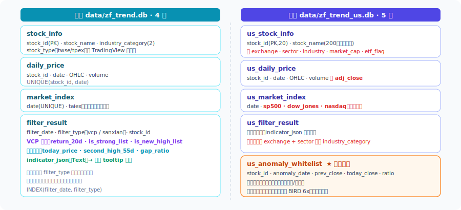
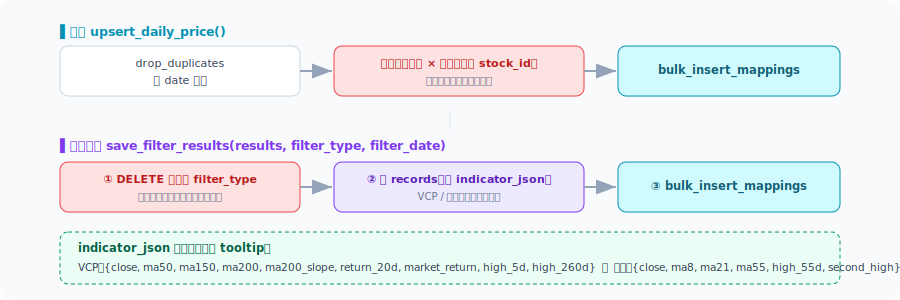
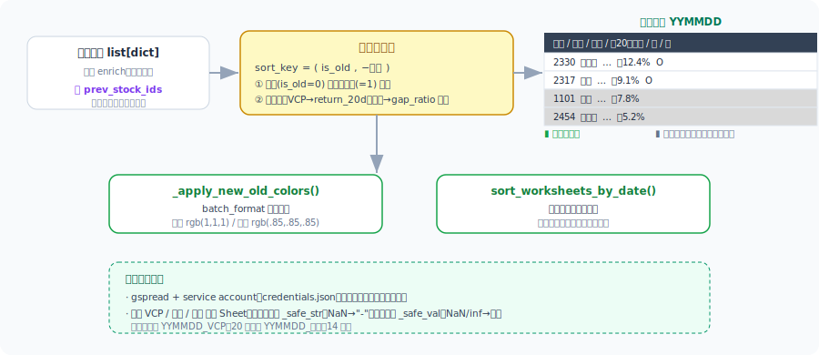
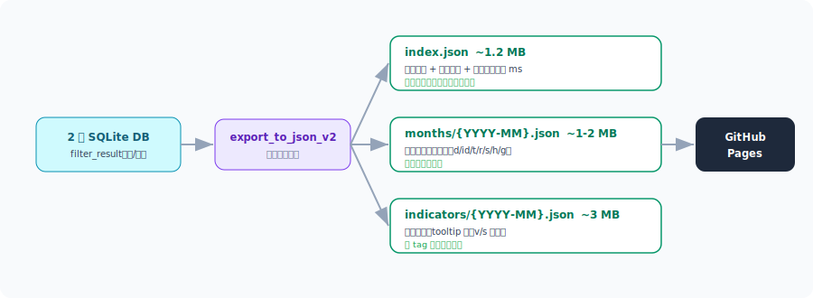
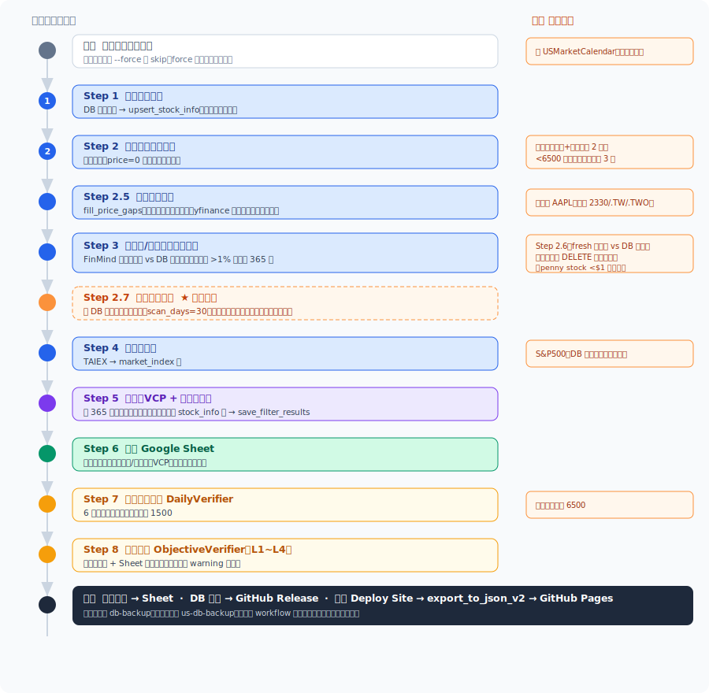

# 端到端資料流程圖解（Pipeline Flow）

> **這份文件做什麼**：用一條主線把整個系統串起來 —— **抓資料 → 計算篩選 → 寫入資料庫 → 匯出 Google Sheet / 前端 JSON**，並以 SVG 流程圖逐階段拆解，對照台股與美股的差異。
>
> **檢視提示**：流程圖為獨立 SVG 圖檔，放在 [`diagrams/`](diagrams/) 目錄，以 Markdown 圖片方式引用。GitHub 網頁版、VS Code Markdown Preview（`⌘K V`）、Obsidian、Typora 等皆可正常顯示。SVG 為向量圖，放大不失真。
>
> 相關文件：[技術架構](02-architecture.md)、[資料規格](03-data-spec.md)、[演算法規格](04-algorithm-spec.md)、[操作指南](05-operations-guide.md)

---

## 目錄

- [0. 全景：一張圖看懂整條 Pipeline](#0-全景一張圖看懂整條-pipeline)
- [1. 階段一 — 抓資料（Fetch）](#1-階段一--抓資料fetch)
- [2. 階段二 — 計算與篩選（Compute）](#2-階段二--計算與篩選compute)
- [3. 階段三 — 寫入資料庫（Persist）](#3-階段三--寫入資料庫persist)
- [4. 階段四 — 匯出（Export）](#4-階段四--匯出export)
- [5. 每日任務完整編排（Orchestration）](#5-每日任務完整編排orchestration)
- [6. 台股 vs 美股 全差異對照](#6-台股-vs-美股-全差異對照)
- [7. 容錯、重試與資料完整性保護](#7-容錯重試與資料完整性保護)
- [8. 關鍵函式索引](#8-關鍵函式索引)

---

## 0. 全景：一張圖看懂整條 Pipeline

四個階段、單向資料流。台股與美股共用同一套流程骨架，但資料源、資料庫與篩選模組完全隔離。

**一句話總結**：每天排程觸發後，系統先把當日股價抓回來（階段一），用均線跑出 VCP 與三線開花兩組清單（階段二），覆寫式寫進 SQLite（階段三），再推到 Google Sheet 與前端 JSON 供查詢（階段四），最後用獨立資料源做客觀驗證。

---

## 1. 階段一 — 抓資料（Fetch）

> **目標**：把當日（及必要的歷史）個股 OHLCV、大盤指數抓回本機，寫進 `daily_price` / `us_daily_price`。
> **程式碼**：`api/`（各 client）、`tasks/daily_task.py` 與 `tasks/us_daily_task.py` 的下載步驟。

### 1.1 台股 — HybridClient 三段式主備

台股以 **FinMind 為主來源、yfinance 為備援**。`HybridClient.get_stock_price()` 不是「主壞才換備」這麼簡單，而是依「成功率」決定要整批改用備援、還是只補缺漏：

**關鍵閾值**：股票清單少於 `1000` 檔、或股價成功率低於 `0.5`，就觸發 yfinance 備援（`hybrid_client.py:29-30`）。FinMind 端的請求都經 `RateLimiter`（600 次/時 → 6 秒/次）與 `RetryHandler`（僅對 5XX / 429 重試，間隔 5/10/60 分）。收盤價為 0 的異常列會用 `_fix_zero_prices_with_yfinance()` 補回。

### 1.2 美股 — yfinance 批次下載

美股單純以 yfinance 為來源，重點在**分批節流**與**缺料重試**。清單來自 NASDAQ FTP，股價以 40 檔為一批：

> **為什麼美股要下載「2 天」？** `_fetch_and_save_prices()` 會抓「前一交易日 + 當日」共 2 天，前一日用來在 Step 2.6 做**分割/合股偵測**的比對基準（見 [第 5 節](#5-每日任務完整編排orchestration)）。

---

## 2. 階段二 — 計算與篩選（Compute）

> **目標**：用日線收盤價算出均線，跑出 **VCP 強勢股** 與 **三線開花** 兩組清單。
> **程式碼**：`calculators/`（台股）與對應 `us_*`（美股）；演算法邏輯兩邊完全相同，僅參數來源與大盤指數不同。
> **輸入**：DB 取出的 365 天 `price_df` + 大盤 20 日報酬。**輸出**：通過清單（含指標欄位）。

### 2.1 均線前置計算

篩選前先針對兩種策略各自準備指標管線（皆用**收盤價**算均線；新高判斷另用**最高價**）：

| 策略 | 前置函式 | 計算內容 |
|------|----------|----------|
| VCP | `prepare_vcp_data()` | 零價修正 → SMA50/150/200 → MA200 斜率(20日) → return_20d → high_5d / high_260d（最高價） |
| 三線開花 | `prepare_sanxian_data()` | 零價修正 → SMA8/21/55 → high_55d（收盤價新高）→ second_high_55d（收盤價次高） |

### 2.2 VCP 強勢股篩選

最終 VCP 清單 =（**強勢清單** ∪ **新高清單**），且兩者都必須先通過「**打敗大盤**」的共同遮罩：

### 2.3 三線開花篩選

三線開花**不需要大盤報酬**，純看短中期均線多頭與收盤價創新高，最後算出「離前高還差多少」的 `gap_ratio`：

> **參數一致、實作微差**：台股與美股的篩選門檻完全相同（容差 1%、260 日、MA 週期…）。唯一程式差異是 `calculate_high_low` 的 `min_periods`（台股 `1`、美股 `max(period//2,1)`），影響資料不足時 `high_5d`/`high_260d` 是否為 NaN。詳見 [演算法規格](04-algorithm-spec.md)。

---

## 3. 階段三 — 寫入資料庫（Persist）

> **目標**：把股價、大盤、篩選結果落地到 SQLite。台股與美股各自一個 DB 檔，完全隔離。
> **程式碼**：`data/sqlite_database.py`（台股）、`data/us_database.py`（美股）。`data/database.py` 為 PostgreSQL 版（容器環境用），runtime 走 SQLite。

### 3.1 資料表總覽（台股 4 表 / 美股 5 表）

### 3.2 寫入策略：覆寫式刪後插

兩種寫入都刻意避開「原生 upsert」，改用「**先刪除即將覆蓋的範圍，再批次插入**」，以繞過 SQLite 的限制並修正歷史上的笛卡爾積誤刪 bug：

---

## 4. 階段四 — 匯出（Export）

> **目標**：把篩選結果推到兩個出口 ——（1）給人看的 **Google Sheet**、（2）給前端網站用的 **拆分 JSON**。
> **程式碼**：`exporters/google_sheet.py`、`exporters/us_google_sheet.py`、`scripts/export_to_json_v2.py`。

### 4.1 Google Sheet — 顏色排序 + 新舊標記

匯出器收到的是 daily_task 傳入的 in-memory 篩選結果（已 enrich），加上「前一交易日同類型清單」`prev_stock_ids` 用來判斷新舊，最後以 **顏色優先、指標次之** 的複合鍵排序並套背景色：

> **NaN 陷阱**：美股 sector/industry 來自 yfinance，可能是 `NaN`。由於 `NaN` 在 Python 是 truthy（`nan or "-"` 會回傳 `nan`），必須用 `_safe_str()` 而非 `or` 來給預設值 `"-"`。

### 4.2 前端 JSON — 三層拆分與 Lazy Loading

`export_to_json_v2.py` 直接讀兩個 DB，把資料拆成三種檔案，讓前端只在需要時才載入對應月份，避免一次下載巨檔：

---

## 5. 每日任務完整編排（Orchestration）

> 把上面四個階段串起來的就是 `DailyTask.run()`（`tasks/daily_task.py:59`）與 `USDailyTask.run()`（`tasks/us_daily_task.py:60`）。下圖以台股流程為主軸，右側橘色標註美股的差異與額外步驟。

> **容錯設計**：Step 2.5 補漏、分割偵測、Step 7/8 驗證全程以 `try/except` 包覆，失敗只記 warning 不中斷主流程。只有「股票清單為空」「股價 0 筆」會提前 return 終止當日任務。

---

## 6. 台股 vs 美股 全差異對照

兩套系統共用同一套 pipeline 骨架，但在每一階段都有針對市場特性的差異：

| 面向 | 🇹🇼 台股 | 🇺🇸 美股 |
|------|---------|---------|
| 主程式 | `main.py` | `us_main.py` |
| 資料庫 | `data/zf_trend.db`（4 表） | `data/zf_trend_us.db`（5 表，多 `us_anomaly_whitelist`） |
| 設定檔 | `config/settings.py` | `config/us_settings.py` |
| 股票清單來源 | FinMind `TaiwanStockInfo` | NASDAQ FTP `nasdaqtraded.txt` |
| 股價來源 | HybridClient（FinMind 主 + yfinance 備/補） | yfinance 批次（40 檔/批，間隔 15s） |
| `close_price` 內容 | 未調整收盤價（與券商均線一致） | 調整後收盤價 adj_close（另存原始 OHLC + adj_close） |
| Step 2 下載範圍 | 單日 | 前一日 + 當日（共 2 天，供分割比對） |
| 分割偵測 | Step 3：FinMind 還原權息價比對 >1% 重抓 | Step 2.6（fresh vs DB）+ Step 2.7（內部相鄰跳動）兩層；重抓前先 DELETE |
| 大盤指數 | TAIEX（單欄 `taiex`） | S&P500 + 道瓊 + 那斯達克（三欄） |
| 篩選演算法 | VCP / 三線（`calculators/`） | 邏輯**完全相同**（`us_*`），參數值一致 |
| 產業欄位 | `industry_category` / `industry_category2` | `sector` / `industry`（+ exchange、market_cap） |
| 驗證最低筆數 | 1500 | 6500 |
| Google Sheet | VCP / 三線 / 驗證（獨立 Sheet ID） | 同結構、獨立 Sheet ID；sector/industry 用 `_safe_str` 防 NaN |
| DB 備份 Release | `db-backup` | `us-db-backup` |
| 排程（GitHub Actions） | 週一~五 UTC 09:45 | 週一~五 UTC 21:30（美股收盤後） |

> **隔離原則**：美股功能不影響台股，反之亦然。兩者唯一共用的是 Google service account 憑證（`credentials.json`）。

---

## 7. 容錯、重試與資料完整性保護

整條 pipeline 的關鍵保護機制與參數一覽：

| 機制 | 觸發條件 | 行為 | 來源 |
|------|----------|------|------|
| FinMind 限流 | 每次 API 請求 | RateLimiter 600 次/時（6 秒/次），thread-safe | `rate_limiter.py:39` |
| FinMind 重試 | 回應 5XX / 429 | 重試 3 次，間隔 5/10/60 分（4XX 不重試） | `rate_limiter.py:123` |
| Hybrid 備援 | 清單 <1000 檔 或 股價成功率 <50% | 整批改用 yfinance | `hybrid_client.py:29-30` |
| 收盤 0 價修正 | FinMind 回 close=0 | 用 yfinance `.TW`/`.TWO` 補回 | `finmind_client.py:165` |
| 美股股價完整性 | 當日 <6500 筆 | 視為殘缺，強制重新下載（正常約 6000+ 筆） | `us_daily_task.py:229` |
| 美股缺料重試 | 部分股票無資料 | 最多 3 次，等待 5/15/15 分鐘，只重抓 missing | `us_daily_task.py:264` |
| 補漏缺口 | 篩選前偵測歷史缺日 | 以基準股建交易日曆，yfinance 補（上限 200 檔） | `price_gap_filler.py:17` |
| 分割偵測（台） | 還原價 vs DB >1% | 重抓 365 天還原歷史 | `split_detector.py` |
| 分割偵測（美） | fresh vs DB >1%、ratio 1.5/0.67 | DELETE 後重抓；penny stock <$1 不偵測 | `us_daily_task.py:356` |
| 內部分割（美） | DB 相鄰跳動異常 | 掃 30 天修正，白名單排除真實暴漲 | `internal_split_detector.py` |
| 篩選異常過濾 | return_20d ≤ −0.9 或 ≥ 5.0 | 視為分割未修正，排除出清單 | `vcp_filter.py` beat_market |
| 每日驗證 | 任務尾段 | DailyVerifier 6 項 + ObjectiveVerifier L1~L4 | `daily_task.py:168-176` |
| 任務中止 | 股票清單空 / 股價 0 筆 | 提前 return，不寫入髒資料 | `daily_task.py` |

---

## 8. 關鍵函式索引

依階段列出最重要的進入點，方便對照原始碼（`檔案:行號`）：

**抓資料層**
- `api/hybrid_client.py:105` — `HybridClient.get_stock_price()` 三段式主備
- `api/finmind_client.py:71` — `FinMindClient._make_request()` 限流 + 重試核心
- `api/finmind_client.py:165` — `_fix_zero_prices_with_yfinance()` 零價修正
- `api/us_stock_client_free.py:113` — `USStockClientFree.get_stock_price()` 40 檔/批下載
- `api/rate_limiter.py:39` — `RateLimiter.wait()` token-bucket 節流
- `utils/price_gap_filler.py:17` — `fill_price_gaps()` 補漏缺口

**計算/篩選層**
- `calculators/moving_average.py:273` — `prepare_vcp_data()` VCP 均線前置
- `calculators/moving_average.py:307` — `prepare_sanxian_data()` 三線均線前置
- `calculators/vcp_filter.py:60` — `VCPFilter.filter()` VCP 主流程（強勢 ∪ 新高）
- `calculators/vcp_filter.py:192` — `calculate_market_return()` 大盤 20 日報酬
- `calculators/sanxian_filter.py:46` — `SanxianFilter.filter()` 三線開花主流程

**資料庫層**
- `data/sqlite_database.py:189` — `upsert_daily_price()` 股價刪後插
- `data/sqlite_database.py:333` — `save_filter_results()` 篩選結果覆寫式寫入
- `data/us_database.py:216` — 美股股價（含 adj_close）
- `data/us_database.py:384` — 美股篩選結果（含 exchange/sector）

**匯出層**
- `exporters/google_sheet.py:309` — `export_vcp()` VCP 匯出（排序 + 套色）
- `exporters/google_sheet.py:440` — `export_sanxian()` 三線匯出
- `exporters/google_sheet.py:576` — `_apply_new_old_colors()` 新舊背景色
- `scripts/export_to_json_v2.py:128` — `main()` 前端三層 JSON 拆分

**編排層**
- `tasks/daily_task.py:59` — `DailyTask.run()` 台股每日主流程（8 step）
- `tasks/us_daily_task.py:60` — `USDailyTask.run()` 美股每日主流程（含 2.6 / 2.7）

---

_本文件由 pipeline 各層原始碼整理而成，與 `02-architecture.md`、`03-data-spec.md`、`04-algorithm-spec.md` 交叉驗證。若程式碼變更，請同步更新對應 SVG 與函式行號。_

